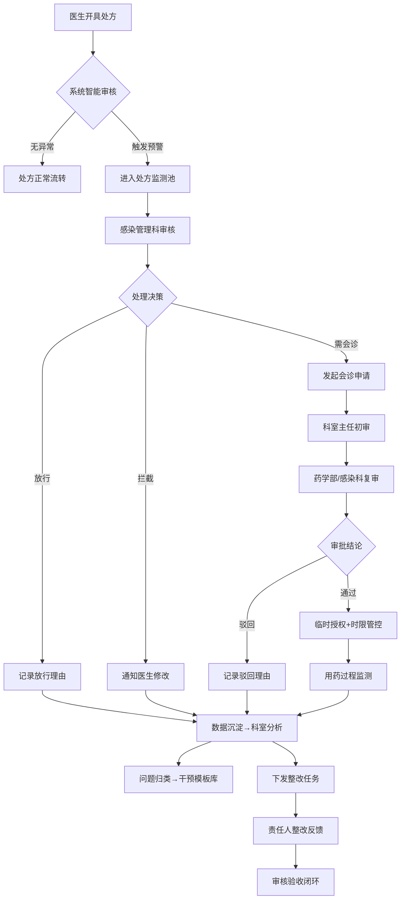

## 1. 产品概述

抗菌药物管理系统（Antimicrobial Stewardship System，AMS）是面向医院药学部负责人、感染管理科人员和临床科室主任的专业管理平台。系统通过抗菌药物分级授权、处方智能审核、科室用药监测和会诊审批流程，实现限制级、特殊级抗菌药物的透明化、规范化管理，沉淀完整的干预记录与决策数据。

产品价值：
- 降低抗菌药物不合理使用率，遏制细菌耐药趋势
- 提升处方审核效率，减少越级用药和无指征用药
- 建立可追溯的用药审批与整改闭环管理
- 为医院等级评审和抗菌药物临床应用专项整治提供数据支撑

---

## 2. 核心功能

### 2.1 用户角色

| 角色 | 说明 | 核心权限 |
|------|------|----------|
| 药学部负责人 | 系统管理员、最终审批人 | 全部功能权限，目录维护，终审权限，全院分析 |
| 感染管理人员 | 日常监测与干预执行者 | 处方监测，预警处理，会诊参与，整改跟踪 |
| 临床科室主任 | 科室管理第一责任人 | 本科室数据查看，科室权限配置，本科室整改审核 |
| 临床医生 | 处方开具者 | 查看本人权限，发起会诊/特殊用药申请，查看本人整改任务 |

### 2.2 功能模块

1. **首页总览**：风险总览卡片、待审批事项、近期趋势图表、快速入口
2. **分级目录页**：抗菌药物分级目录维护、适用说明、禁忌症、警示信息
3. **权限管理页**：按科室/职称/岗位配置处方权限、权限矩阵、批量调整
4. **处方监测页**：问题处方筛选（越级/超疗程/重复联用/无指征）、预警详情、快速干预
5. **会诊审批页**：会诊/特殊用药申请列表、审批流程、意见记录、电子签名
6. **科室分析页**：使用强度（DDDs）、预警次数、整改完成率、医生排名、月度对比
7. **整改跟踪页**：整改任务下发、干预模板、反馈审核、闭环追踪

### 2.3 页面详情

| 页面名称 | 模块名称 | 功能描述 |
|----------|----------|----------|
| 首页总览 | 风险卡片 | 展示重点风险：越级用药数、特殊级待审批、超疗程预警、高风险科室TOP3 |
| 首页总览 | 待办事项 | 待审批会诊申请、待处理预警、待反馈整改任务列表 |
| 首页总览 | 趋势图表 | 近30天预警趋势、DDDs趋势、分级药物使用占比饼图 |
| 首页总览 | 快捷入口 | 常用功能快速导航卡片 |
| 分级目录页 | 药物列表 | 按非限制级/限制级/特殊级三级分类展示，支持搜索筛选 |
| 分级目录页 | 详情编辑 | 药物名称、规格、分级、适应症、禁忌症、用法用量、警示等级配置 |
| 分级目录页 | 批量操作 | 批量调整分级、批量导入导出、批量设置警示规则 |
| 权限管理页 | 权限矩阵 | 科室×职称×药物分级的三维权限配置矩阵视图 |
| 权限管理页 | 人员列表 | 按人员配置个人权限、历史权限变更记录 |
| 权限管理页 | 角色模板 | 基于岗位/职称的权限模板一键应用 |
| 处方监测页 | 筛选面板 | 按患者、医生、科室、时间、预警类型、严重等级多维筛选 |
| 处方监测页 | 预警列表 | 问题处方清单，标记严重等级、处理状态，支持批量处理 |
| 处方监测页 | 处方详情 | 完整处方信息、用药分析、预警原因、历史用药对比 |
| 处方监测页 | 干预操作 | 一键拦截、退回修改、发会诊、记录干预意见 |
| 会诊审批页 | 申请列表 | 待审批/已审批/已驳回申请分类查看，支持高级搜索 |
| 会诊审批页 | 审批工作台 | 患者信息、病历摘要、申请理由、用药方案、审批意见输入 |
| 会诊审批页 | 审批留痕 | 完整审批链路：申请人→初审人→终审人，时间戳+电子签名 |
| 会诊审批页 | 时限管理 | 审批超时自动提醒，特殊级用药紧急绿色通道标识 |
| 科室分析页 | KPI看板 | 使用强度、限制级占比、特殊级占比、预警次数、整改率 |
| 科室分析页 | 科室对比 | 多科室横向对比柱状图、排名表 |
| 科室分析页 | 月度趋势 | 单科室近12个月DDDs与预警趋势折线图 |
| 科室分析页 | 医生排名 | 科室内部医生DDDs、预警次数排名，支持下钻 |
| 整改跟踪页 | 任务管理 | 整改任务下发、指定责任人、截止日期、优先级 |
| 整改跟踪页 | 干预模板 | 高频问题分类模板库：典型案例、标准话术、整改建议 |
| 整改跟踪页 | 反馈审核 | 整改反馈提交、审核通过/退回、整改效果评估 |
| 整改跟踪页 | 闭环统计 | 按科室/问题类型统计整改完成率、平均整改时长、复发率 |

---

## 3. 核心流程

### 3.1 处方审核预警流程
医生开具处方 → 系统实时校验（分级权限/疗程/联用/指征） → 触发预警 → 感染管理人员审核 → 拦截/放行/退回 → 记录干预 → 形成统计数据

### 3.2 特殊用药审批流程
医生发起会诊/特殊用药申请 → 上传病历摘要与用药方案 → 科室主任初审 → 感染管理科/药学部复审 → 终审通过 → 权限临时授予 → 用药监测 → 到期自动回收

### 3.3 整改闭环流程
监测发现问题 → 下发整改任务（可套用模板） → 责任人签收 → 提交整改反馈 → 审核人验收 → 通过归档/退回重改 → 整改率统计

### 3.4 Mermaid 流程图

---

## 4. 用户界面设计

### 4.1 设计风格

- **整体定位**：专业医疗管理系统，数据驱动、严肃理性、高信息密度
- **主色调**：深海蓝 `#0F2C59`（专业权威）+ 医疗青 `#0891B2`（科技感）
- **辅助色**：
  - 非限制级：翠绿 `#10B981`（安全）
  - 限制级：琥珀橙 `#F59E0B`（注意）
  - 特殊级：深红 `#EF4444`（警告）
  - 预警/风险：玫红 `#EC4899`
- **背景色**：冷灰白 `#F8FAFC` 底色 + 纯白 `#FFFFFF` 卡片 + 浅灰分割线
- **按钮样式**：方中带圆（border-radius: 6px），实心填充主色，幽灵按钮描边
- **字体**：标题使用 Noto Serif SC（衬线体体现专业严谨），正文使用 Inter（无衬线体保证可读性），数据数字使用 JetBrains Mono（等宽字体对齐美观）
- **布局风格**：
  - 左侧固定导航栏（深色底），主体区域卡片式模块化布局
  - 大量使用数据表格 + 图表组合，信息层级清晰
  - 关键数据卡片带微渐变背景和细边框，阴影克制
- **图标风格**：使用 Phosphor Icons 线性图标，统一20px尺寸，严肃专业不花哨

### 4.2 页面设计概览

| 页面名称 | 模块名称 | UI 设计要点 |
|----------|----------|-------------|
| 首页总览 | 风险卡片 | 4张渐变卡片（红/橙/青/蓝）+ 大号数字 + 环比箭头 + 迷你趋势线 |
| 首页总览 | 待办事项 | 三栏Tab切换（待审批/待处理/待反馈），每行带优先级标签和倒计时 |
| 首页总览 | 趋势图表 | 双图布局：左折线图（预警+DDDs双轴），右堆叠柱状图（分级药物使用） |
| 分级目录页 | 药物列表 | 顶部筛选栏+Tab分级切换，表格斑马纹，严重等级用色点标识 |
| 权限管理页 | 权限矩阵 | 热力图式矩阵，颜色深浅表示权限级别，悬停显示详情弹窗 |
| 处方监测页 | 预警列表 | 左筛选面板+右数据表格，高危行深红底色，支持行内快捷操作 |
| 会诊审批页 | 审批工作台 | 三栏布局：左患者信息摘要，中申请内容，右审批操作与历史审批 |
| 科室分析页 | KPI看板 | 顶部大数字KPI卡片，下方分区：科室对比、月度趋势、医生排名 |
| 整改跟踪页 | 任务管理 | 看板视图（待处理/整改中/待审核/已完成）+ 列表视图切换 |

### 4.3 响应式设计

- **桌面端优先**：最小支持宽度 1366px，最优分辨率 1920×1080
- **平板适配**：≤1024px 时左侧导航收起为图标模式，卡片单列堆叠
- **不提供移动端**：本系统为专业管理后台，以桌面操作为主

### 4.4 动效与交互

- 页面加载：侧边栏+顶栏先出现，内容区卡片渐次上浮（stagger 50ms）
- 卡片悬停：边框色变主色，轻微上浮 translate(0, -2px)，阴影加深
- 数据刷新：数字滚动变化（count-up动画），图表曲线平滑过渡
- 审批操作：点击审批按钮后按钮展开为理由输入框（垂直展开动画）
- 预警闪烁：高危预警行首次加载时呼吸闪烁3次（opacity 0.7→1）
