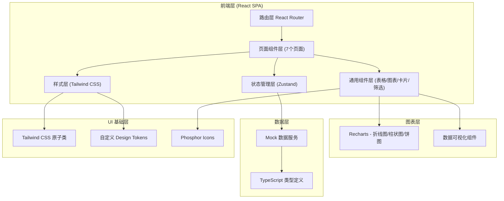
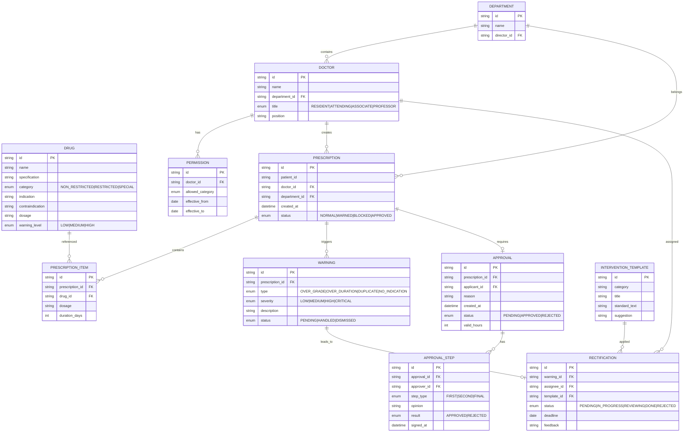

## 1. 架构设计



---

## 2. 技术栈说明

- **前端框架**：React 18 + TypeScript 5
- **构建工具**：Vite 5
- **样式方案**：Tailwind CSS 3 + PostCSS
- **状态管理**：Zustand（轻量级，替代 Redux）
- **路由管理**：React Router v6
- **图表库**：Recharts 2（React 原生，支持 TS）
- **图标库**：@phosphor-icons/react
- **日期处理**：dayjs
- **数据**：全量 Mock 数据（TypeScript 类型驱动）
- **代码规范**：ESLint + Prettier

---

## 3. 路由定义

| 路由路径 | 页面组件 | 页面说明 |
|----------|----------|----------|
| `/` | DashboardPage | 首页总览 - 风险卡片、待办、趋势、快捷入口 |
| `/catalog` | CatalogPage | 分级目录页 - 抗菌药物三级分类目录维护 |
| `/permissions` | PermissionsPage | 权限管理页 - 科室/职称/人员权限矩阵配置 |
| `/monitoring` | MonitoringPage | 处方监测页 - 问题处方筛选、预警列表、干预操作 |
| `/approval` | ApprovalPage | 会诊审批页 - 会诊/特殊用药申请审批工作台 |
| `/analytics` | AnalyticsPage | 科室分析页 - KPI看板、科室对比、月度趋势、医生排名 |
| `/rectification` | RectificationPage | 整改跟踪页 - 整改任务看板、干预模板、闭环追踪 |

---

## 4. 目录结构

```
src/
├── assets/                  # 静态资源
│   └── fonts/              # 本地字体文件
├── components/             # 通用组件
│   ├── layout/            # 布局组件 (Sidebar, Header, PageContainer)
│   ├── ui/                # 基础UI (Card, Button, Badge, Tag, Table, Modal)
│   ├── charts/            # 图表封装 (LineChart, BarChart, PieChart)
│   └── features/          # 业务组件 (FilterPanel, ApprovalFlow, TaskCard)
├── pages/                 # 页面组件
│   ├── Dashboard/
│   ├── Catalog/
│   ├── Permissions/
│   ├── Monitoring/
│   ├── Approval/
│   ├── Analytics/
│   └── Rectification/
├── store/                 # Zustand stores
│   ├── useUserStore.ts
│   ├── usePrescriptionStore.ts
│   └── useApprovalStore.ts
├── data/                  # Mock 数据
│   ├── drugs.ts          # 药物目录
│   ├── prescriptions.ts  # 处方数据
│   ├── departments.ts    # 科室/人员
│   └── approvals.ts      # 审批数据
├── types/                 # TypeScript 类型定义
│   ├── drug.ts
│   ├── prescription.ts
│   ├── approval.ts
│   └── analytics.ts
├── utils/                 # 工具函数
│   ├── format.ts         # 数字/日期格式化
│   ├── constants.ts      # 常量枚举
│   └── helpers.ts
├── styles/                # 全局样式
│   └── globals.css
├── router/                # 路由配置
│   └── index.tsx
├── App.tsx
└── main.tsx
```

---

## 5. 核心数据模型

### 5.1 ER 图



---

## 6. 核心类型定义

```typescript
// 抗菌药物分级
export type DrugCategory = 'NON_RESTRICTED' | 'RESTRICTED' | 'SPECIAL';

// 预警类型
export type WarningType = 'OVER_GRADE' | 'OVER_DURATION' | 'DUPLICATE' | 'NO_INDICATION';

// 严重等级
export type Severity = 'LOW' | 'MEDIUM' | 'HIGH' | 'CRITICAL';

// 审批状态
export type ApprovalStatus = 'PENDING' | 'IN_PROGRESS' | 'APPROVED' | 'REJECTED';

// 整改状态
export type RectificationStatus = 'PENDING' | 'IN_PROGRESS' | 'REVIEWING' | 'DONE' | 'REJECTED';

// 职称
export type DoctorTitle = 'RESIDENT' | 'ATTENDING' | 'ASSOCIATE_PROFESSOR' | 'PROFESSOR';

export interface Drug {
  id: string;
  name: string;
  genericName: string;
  specification: string;
  category: DrugCategory;
  manufacturer: string;
  indication: string;
  contraindication: string;
  dosage: string;
  warningLevel: Severity;
  dddValue: number;
  dddUnit: string;
  updatedAt: string;
}

export interface PrescriptionWarning {
  id: string;
  prescriptionId: string;
  patientName: string;
  patientAge: number;
  patientGender: 'M' | 'F';
  doctorName: string;
  doctorTitle: DoctorTitle;
  departmentName: string;
  warningType: WarningType;
  severity: Severity;
  description: string;
  drugs: string[];
  createdAt: string;
  status: 'PENDING' | 'HANDLED' | 'DISMISSED';
  handler?: string;
  handledAt?: string;
  handleOpinion?: string;
}

export interface ApprovalRequest {
  id: string;
  applicantName: string;
  applicantTitle: DoctorTitle;
  departmentName: string;
  patientName: string;
  patientDiagnosis: string;
  drugName: string;
  drugCategory: DrugCategory;
  reason: string;
  proposedDosage: string;
  proposedDuration: number;
  createdAt: string;
  status: ApprovalStatus;
  validHours?: number;
  currentStep: number;
  steps: ApprovalStep[];
}

export interface DepartmentKPI {
  departmentId: string;
  departmentName: string;
  ddds: number;
  dddsRank: number;
  restrictedRatio: number;
  specialRatio: number;
  warningCount: number;
  warningRank: number;
  rectificationRate: number;
  lastMonthDDDs: number;
  lastMonthWarnings: number;
}
```

---

## 7. 设计系统与 Tailwind 配置

### 7.1 Design Tokens（Tailwind config 扩展）

```js
module.exports = {
  theme: {
    extend: {
      colors: {
        // 品牌主色
        navy: {
          50: '#F0F4FA',
          100: '#D9E2F0',
          500: '#0F2C59', // 主色 深海蓝
          600: '#0B2247',
          700: '#081935',
        },
        teal: {
          500: '#0891B2', // 辅助色 医疗青
          600: '#0E7490',
        },
        // 抗菌药物分级色
        drug: {
          normal: '#10B981',   // 非限制级 - 翠绿
          restricted: '#F59E0B', // 限制级 - 琥珀橙
          special: '#EF4444',    // 特殊级 - 深红
        },
        // 预警等级
        severity: {
          low: '#3B82F6',
          medium: '#F59E0B',
          high: '#F97316',
          critical: '#DC2626',
        },
      },
      fontFamily: {
        serif: ['"Noto Serif SC"', 'serif'],     // 标题衬线
        sans: ['Inter', 'system-ui', 'sans-serif'], // 正文无衬线
        mono: ['"JetBrains Mono"', 'monospace'],  // 数据等宽
      },
      boxShadow: {
        'card': '0 1px 2px 0 rgb(0 0 0 / 0.04), 0 1px 3px 0 rgb(0 0 0 / 0.06)',
        'card-hover': '0 4px 6px -1px rgb(0 0 0 / 0.08), 0 2px 4px -2px rgb(0 0 0 / 0.06)',
      },
      animation: {
        'fade-in-up': 'fadeInUp 0.4s ease-out forwards',
        'pulse-critical': 'pulseCritical 1.2s ease-in-out 3',
        'count-up': 'countUp 0.8s ease-out forwards',
      },
      keyframes: {
        fadeInUp: {
          '0%': { opacity: '0', transform: 'translateY(12px)' },
          '100%': { opacity: '1', transform: 'translateY(0)' },
        },
        pulseCritical: {
          '0%, 100%': { opacity: '1' },
          '50%': { opacity: '0.6' },
        },
      },
    },
  },
};
```

---

## 8. 状态管理设计

### 8.1 Store 划分

| Store | 职责 | 核心 State | Actions |
|-------|------|-----------|---------|
| `useUserStore` | 用户与权限 | currentUser, roles, permissions | login, switchRole |
| `usePrescriptionStore` | 处方监测 | warnings, filters, selectedWarning | loadWarnings, setFilter, handleWarning |
| `useApprovalStore` | 审批管理 | approvals, activeApproval, approvalSteps | loadApprovals, submitApproval |
| `useCatalogStore` | 药物目录 | drugs, categoryFilter, searchText | loadDrugs, updateDrug |
| `useAnalyticsStore` | 数据分析 | departmentKPIs, trends, doctorRankings | loadKPIs, selectDepartment |
| `useRectificationStore` | 整改跟踪 | tasks, templates, filters | loadTasks, assignTask, reviewTask |

---

## 9. 性能与体验优化

1. **按需加载**：使用 React.lazy + Suspense 做路由级代码分割
2. **虚拟滚动**：处方监测列表支持 react-window 处理 1000+ 行
3. **Memo 优化**：表格行、图表数据使用 useMemo / React.memo
4. **首屏体验**：侧边栏和头部骨架屏先行，内容卡片渐次加载
5. **图表懒渲染**：滚动进入视口后再初始化图表（IntersectionObserver）
